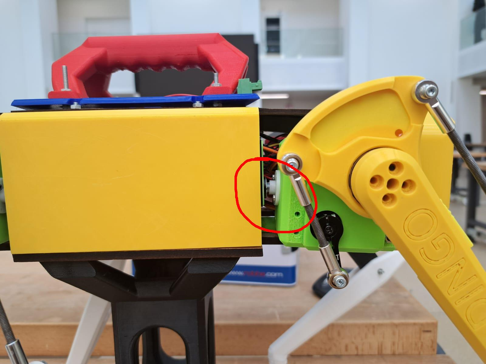

Diagnosis 21.09.2025 by Loïc
=====

I went to DLL to see what was going on with Dingo. The main goal is still the legs here are the things I think we should do:

* **Find/Buy a new cable to program the arduino**
* **Loosen the nut between the hip and the body to allow the leg to move better**
* **Order the Full Parts Kit for Pupper v3**
* Add screw to screw the hip to the body servos

   The hip bending down.

We can see in the picture above that the green hip is not straight with the body.

* Cut out a small part in the wood to more easily reprogram the arduino
* Fix the servo Horn Falling off on the grey hip
* Add the "clapet" to make it easier to put in/ remove the battery
* Organize all of our stuff (maybe with the laser wood boxes)
* Add a see through plane at the top of the robot to be able to see the 7 segments display
* Make a simple walk algorithm for the DINGO on the Arduino
* Start flashing the PI and put ROS on it. Start understanding ROS and doing simulation 