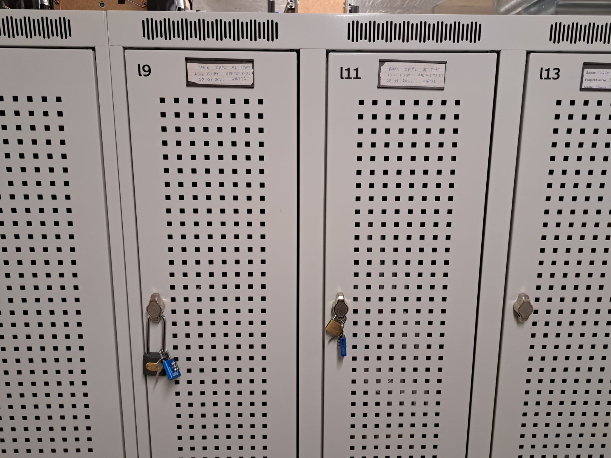

Welcome to EPFL AI TEAM's BARK documentation!
=============================================

Hey there! This is where the BARK team stores all important info. You can find important ressources here and the logs of the work session and the notes of the meeting. For the 2025 - 2026 academic year, our goal is to finish the DINGO robot dog and build the Pupper V3. 

.. list-table::
   :widths: 50 50
   :header-rows: 0
   :align: center

   * - .. figure:: assets/dingo.jpg
          :width: 300px
          :align: center

          Dingo robot

     - .. figure:: assets/pupper.jpg
          :width: 200px
          :align: center

          Pupper V3

**Deadlines and meetings**
--------------------------

Important deadlines/dates : 
~~~~~~~~~~~~~~~~~~~~~~~~~~~

* **12.12 : Semester Review**
* 14.11 : Swiss Robotics Day
* 11.10 : No work session. Hack-a-thon

Work Sessions
~~~~~~~~~~~~~

* Mondays 18h - 21h  
* Saturday 11h - 17h

The first 30 mins of the saturday session will be our weekly meeting. Please try to be present.
If you can't be present to a work session please inform Johnan or Loïc in advance!

**Accessing the DINGO**
-----------------------

At the moment, we are keeping the DINGO and the parts in 2 lockers in Stock 1 at the SPOT. The codes
for the locks are in our WhatsApp groupchat description. You are allowed to work on the DINGO whenever you want.
But if you are not sure of something, ask someone who knows. We would like to avoid breaking things.

   Our lockers at SPOT.

**Ressources**
--------------

`Make`_ : Where you can sign up for the trainings

.. _Make: https://make.epfl.ch/

`Discord`_ : The main communication tool of the AI team

.. _Discord: https://discord.com

`SharePoint`_ : Our drive where we store our documents

.. _SharePoint: https://epflch.sharepoint.com/sites/ETU-EPFL_AI_Team/Documents%20partages/Forms/AllItems.aspx?id=%2Fsites%2FETU%2DEPFL%5FAI%5FTeam%2FDocuments%20partages%2FProjects%20Department%2FRobotics%20Track%2FOngoing%20Projects%2FBARK&viewid=7dda9788%2D4a3e%2D4390%2Dad8a%2D23140ef5bd11

`Kicad`_ : What we use to view PCBs or perhaps one day make our own

.. _Kicad: https://www.kicad.org/

`Fusion360`_ : Our CAD software of choice

.. _Fusion360: https://www.autodesk.com/campaigns/fusion-360

`Our Github Repo`_ : Our code for the DINGO

.. _Our Github Repo: https://github.com/EPFL-AI-Team/BARK

`Taiga`_ : Where tasks are assigned

.. _Taiga: https://taiga.io/

`DINGO repo`_ : The code and explanation of the DINGO

.. _DINGO repo: https://github.com/Yerbert/DingoQuadruped

`Pupper v3 documentation`_ : The bible for Pupper v3

.. _Pupper v3 documentation: https://pupper-v3-documentation.readthedocs.io/en/latest/

**Roles**
---------

Robotics Track Lead
~~~~~~~~~~~~~~~~~~~
* Carlos Hurtado

Project Leads
~~~~~~~~~~~~~
* Johnan Luca  
* Loïc Finette

Members
~~~~~~~
* Anaïs Espindola  
* Louis Britton  
* Luis Jimenez  
* Liam Gibbons  
* Adam Amrahni  
* Christy El Skaff  
* Maxime Blanpain

.. note::

   This project is under active development.

.. include:: _sidebar.rst

