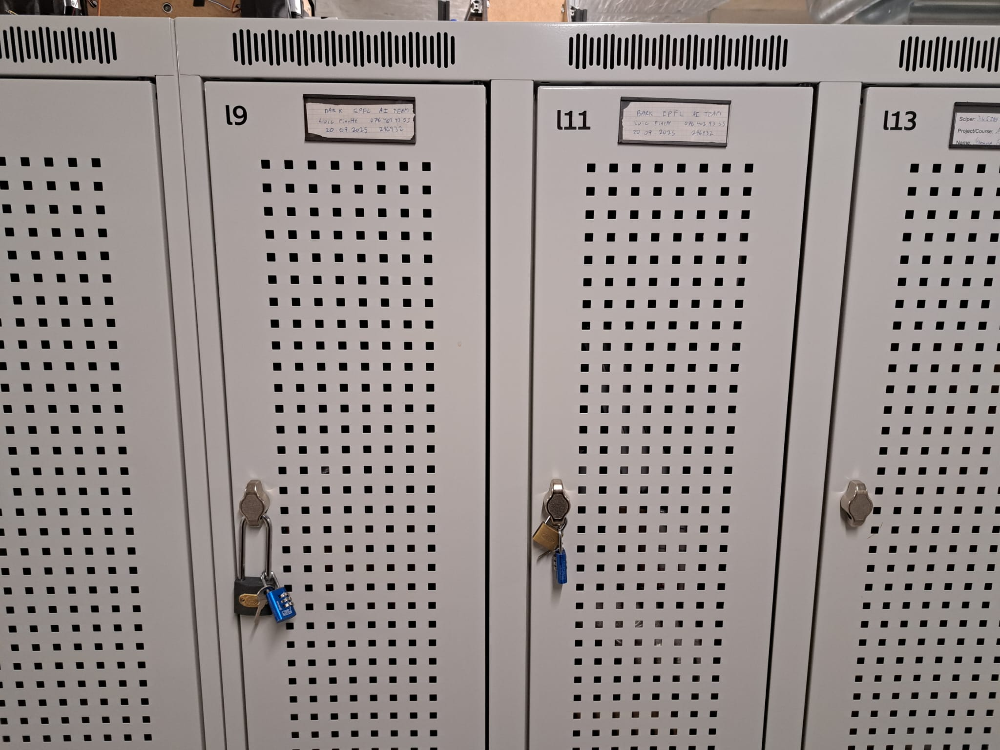

Welcome to EPFL AI TEAM's BARK documentation!
=============================================

Hey there! This is where the BARK team stores all important info. You can find important ressources here and the logs of the work session and the notes of the meeting. For the 2025 - 2026 academic year, our goal is to finish the DINGO robot dog and build the Pupper V3 and start designing our custom dog: BYTE.  

.. list-table::
   :widths: 50 50
   :header-rows: 0
   :align: center

   * - .. figure:: assets/dingo.jpg
          :width: 300px
          :align: center

          Dingo robot

     - .. figure:: assets/pupper.jpg
          :width: 200px
          :align: center

          Pupper V3

**Important dates**
-------------------

* 23.05.2026: XRC presentation
* 22.08.2026: Robovaly Stand

**Main Tasks**
--------------

Team Mecha : 
~~~~~~~~~~~~

* Louis
* Killian
* Rayane
* Paul
* Christy

Team Elect : 
~~~~~~~~~~~~

* Maxime
* Anaïs

Team Software : 
~~~~~~~~~~~~~~~

* Alexandros
* Salah
* Liam

Work Sessions
~~~~~~~~~~~~~

* Mondays 18h - 21h
* Friday 18h - 21h
* Saturday 11h - 18h

The first 30 mins of the saturday session will be our weekly meeting. Please try to be present.
If you can't be present to a work session please inform Johnan or Loïc in advance!

**Accessing DINGO/Pupper/Matos**
--------------------------------

At the moment, we are keeping the DINGO/Pupper and the parts in 4 lockers in Stock 1 at the SPOT. The codes
for the locks are in our WhatsApp groupchat description. You are allowed to work on the DINGO / Pupper whenever you want.
But if you are not sure of something, ask someone who knows. We would like to avoid breaking things.

   Our lockers at SPOT.

**Ressources**
--------------

`Make`_ : Where you can sign up for the trainings

.. _Make: https://make.epfl.ch/

`Discord`_ : The main communication tool of the AI team

.. _Discord: https://discord.com

`SharePoint`_ : Our drive where we store our documents

.. _SharePoint: https://epflch.sharepoint.com/sites/ETU-EPFL_AI_Team/Documents%20partages/Forms/AllItems.aspx?id=%2Fsites%2FETU%2DEPFL%5FAI%5FTeam%2FDocuments%20partages%2FProjects%20Department%2FRobotics%20Track%2FOngoing%20Projects%2FBARK&viewid=7dda9788%2D4a3e%2D4390%2Dad8a%2D23140ef5bd11

`Kicad`_ : What we use to view PCBs or perhaps one day make our own

.. _Kicad: https://www.kicad.org/

`Fusion360`_ : Our CAD software of choice

.. _Fusion360: https://www.autodesk.com/campaigns/fusion-360

`Our Github Repo`_ : Our code for the DINGO

.. _Our Github Repo: https://github.com/EPFL-AI-Team/BARK

`Github Tasks Management`_ : Where tasks are assigned

.. _Github Tasks Management: https://github.com/orgs/EPFL-AI-Team/projects/13

`DINGO repo`_ : The code and explanation of the DINGO

.. _DINGO repo: https://github.com/Yerbert/DingoQuadruped

`Pupper v3 documentation`_ : The bible for Pupper v3

.. _Pupper v3 documentation: https://pupper-v3-documentation.readthedocs.io/en/latest/

**Roles**
---------

Robotics Track Lead
~~~~~~~~~~~~~~~~~~~
* Adam Mesbahi Amrani
* Krish Chawla

Project Leads
~~~~~~~~~~~~~
* Johnan Luca  
* Loïc Finette

Members
~~~~~~~
* Anaïs Espindola  
* Louis Britton  
* Rayane Zouagui
* Liam Gibbons  
* Killian Didierjean
* Christy El Skaff  
* Maxime Blanpain
* Alexandros Dellios
* Salah Hasnaoui
* Paul de Courville

.. note::

   This project is under active development.

.. toctree::
   :maxdepth: 2
   :caption: Meetings
   :hidden:

   /meetings/0_index

.. toctree::
   :maxdepth: 1
   :caption: Work Sessions
   :hidden:
   :glob:

   /work_sessions/*

.. toctree::
   :maxdepth: 1
   :caption: General Info
   :hidden:

   /information/0_safety
   /information/7_events
   /information/5_website

.. toctree::
   :maxdepth: 1
   :caption: DINGO Robot
   :hidden:

   /information/3_dingo
   /information/1_DINGO_Software_setup
   /information/4_dingo_last_sem
   /information/6_diagnosis

.. toctree::
   :maxdepth: 1
   :caption: Pupper & Arm
   :hidden:

   /information/2_Pupper_Software_setup
   /information/8_arm

.. toctree::
   :maxdepth: 1
   :caption: Project Byte
   :hidden:

   /information/9_newdog
   /information/Electronics