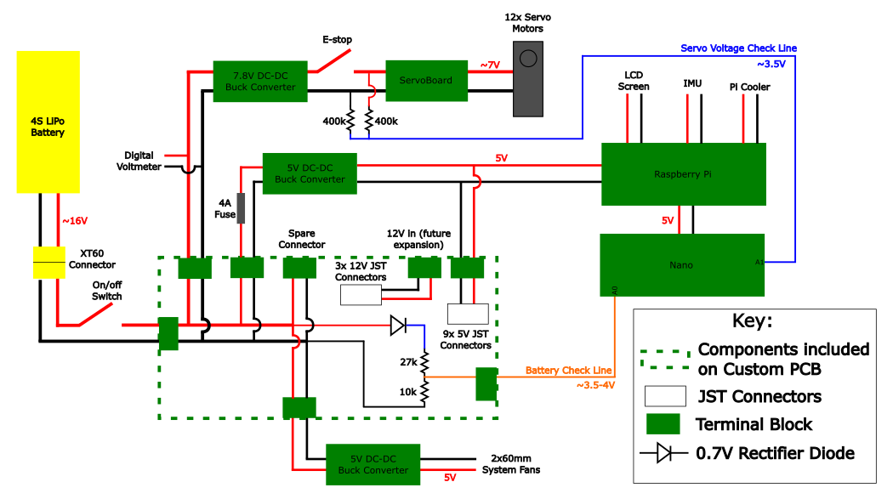
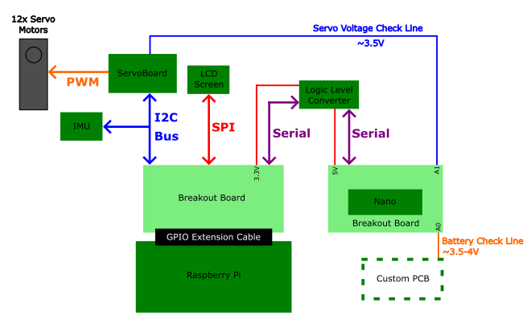
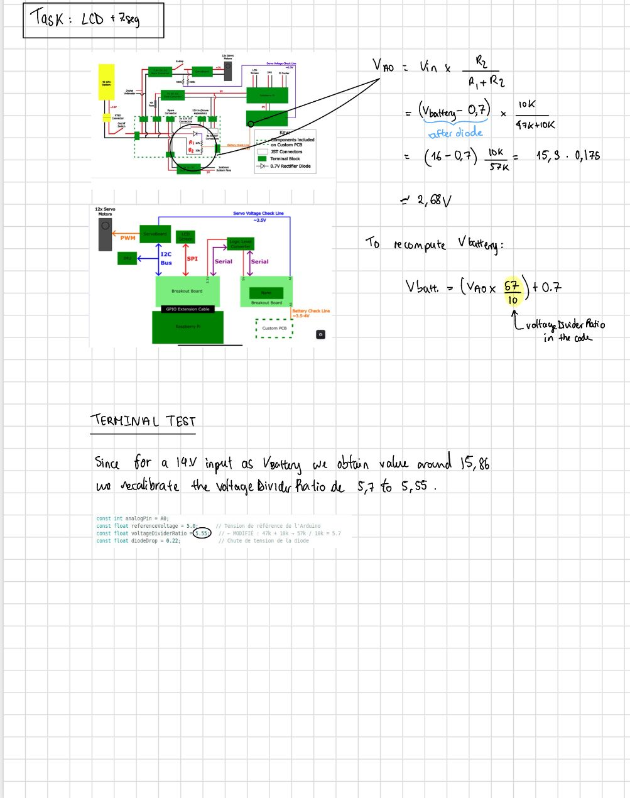

What's in a DINGO?
==================

Power wiring
------------

|

The system is powered by one 16V battery. The custom PCB merely serves to power the
different component. It contains a diode with a resistor bridge plugged to the arduino to determine
the battery voltage. There is one buck converter to power the fans at 5V. One buck is used
to power the Raspberry Pi at 5V. This connection is fused with 4A (normally a Raspberry Pi needs 3A to operate).
The main board is the Pi and the othere modules receiver power from it. A buck converts the voltage
to 7V to power the motors. The Emergency stop button is wired to that line to kill the motors in case of emergency.
There is a voltage check line implemented with 2 400k resistors. The motors are attached to the servo power board to receive power.
There are extra connections on the PCB to eventually power new modules.

Communications wiring
---------------------

|

The main board of this project is the Raspberry Pi. It controls the motors using i2c communication.
It uses the same communication protocol to interface with the IMU. It communicates with the LCD using
SPI. It sends and received data to the Arduino Nano using a level shifter to convert from the Pi's
3.3 V to the Nano's 5V. The nano merely serves as a "multimeter" since it has analog pins that can read
out the voltage.

BARK modifications
------------------

**Resistor bridge in the power board by Annïs Bueno**

We change the 27k resistor to a 47k. We then changed the ratio as follows:

|

**Serial communication modification by Liam Gibbons**

The UART communication between the Pi and the Arduino with GPIOs and the level shifter was way too noisy. We will use the USB protocol
to communicate between the two. More robust.

.. include:: _sidebar.rst
