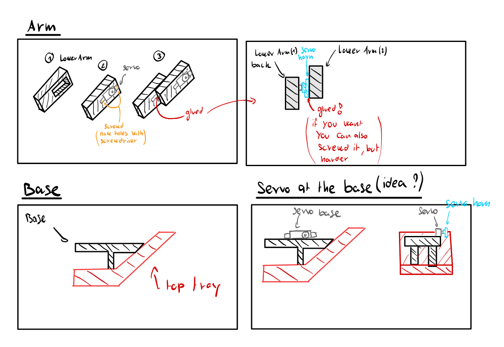
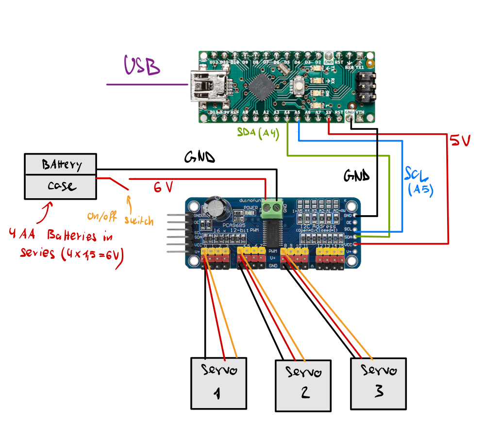

Pupper arm Plan by Johnan 22.11.2025
====================================

Steps to build the Arm
----------------------
1. Glue the top_tray_base on the new top tray. be sure to glue the 45° angle of the base with the 45°angle of the top tray (+- where there is the text "V3.5-10 Power"). Also glue the two square coloumn of the base to the horizontal part of the top-tray
2. Place one servo in the hole of the LowerArm, use an electrical screwdriver to make the 4 holes at the same distance of the servo holes. Screw the servo in (x2). (be sure to run the cable through the hole first)
3. Glue the servo head on the lower part of the LowerArm (x2)
4. Mount the gripper according to the founded CAD
5. Make an L attachement for the base servo, or just glued it the horizontally on the base (Figure out with Loïc how to place the base)
6. Glue the whole arm on the servo on the base.
7. Connect the servo cables on the PCS9685 (servo driverboard)
8. Connect the PCA9685 to the arduino accordingly to the Wiring Diagram
9. Hot glue the electronics
10. Find a place for batteries

Building Plan
-------------

|

Wiring Plan
-----------

|

.. include:: _sidebar.rst