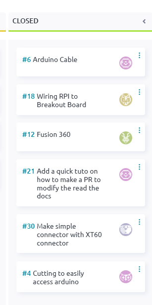

04.10.2025
==========

**TLDR**: Legs still need to be mounted. Let's mount them!

**Location** : DLL

**Members present** Johann, Loïc, Liam, Christy, Adam, Maxime, Anaïs, Luis, Louis

**Tasks closed on Taiga**:

|

Maxime figured out that we need to hide the arduino on the Fusion for the Fusion to work. We said we will
od a soldeing workshop next weekend. Since there is a Hack-a-thon next weekend we will not have a work session
on Saturday. Members seem to not have access to SPOT so we need to check with Krish or Carlos about that.
Most members are continuing their tasks. New tasks assigned are for Louis to work on the beginning project,
Christy to work on the new resistor bridge, Liam to work on the 7 segment.