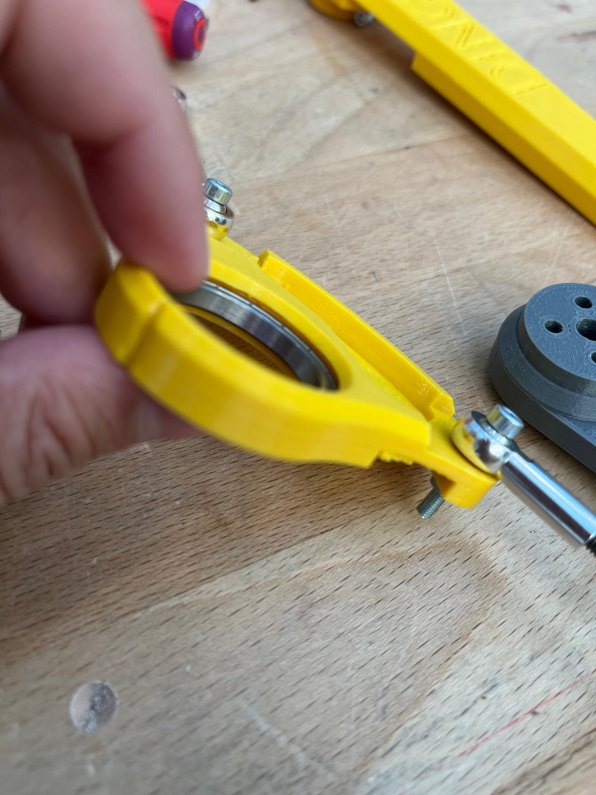

Week of 27.09.2025
==================

**Members present for 27.09.2025 work session** :  Johann, Loïc, Liam, Christy, Adam, Maxime, Anaïs, Luis

**Mechanical Side**

- **Christy**  

  - Cut out the MDF board for the Arduino cable  

- **Maxime** 

  - Printed all the parts for the clapet (still needs assembly)  
  - Reprinted a leg and assembled it (mounting still needed)
  - Missing springs to assemble

- **Johnan**

  - Fusion360 assemplies doesn't show up right, trying to resolve the problem. 

- **Johnan and Maxime**

  - Probably found one problem for the instability:
     -  We noticed that the space for the ball bearing is to big (probabily due to printing tolerances), it may be the cause for instability, needs iteration for testing differents approaches of printing and settings.
     

|

**Electronical Side**

- **Johnan**

  - Resoldered the buck converter inputs (were broken during transportation and handling of the dog). The output isn't well connected, one fan doesn't work properly

- **Anaïs**  

  - wrote the terminal test and 7segment code in arduino --> will do the tests on monday after creating connector with female XT60

- **Loïc**  

  - The fans stop working sometimes. Investigate why. Created ticket on Taiga
  - Arduino not wired properly to read out voltage from the battery

- **Liam**  

  - Learned about the Raspberry Pi  
  - Figured out how to wire the breakout board correctly (testing still needed)

**Software Side**

- **Christy**  

  - Started ROS tutorials  
  - Set up the Raspberry Pi

- **Adam**  

  - Set up the Raspberry Pi  
  - Got the DINGO workspace running properly through Docker
  - Want to go from ROS1 -> ROS2

- **Luis** 

  - Programmed the `test_stand` function (still needs to be finished)
