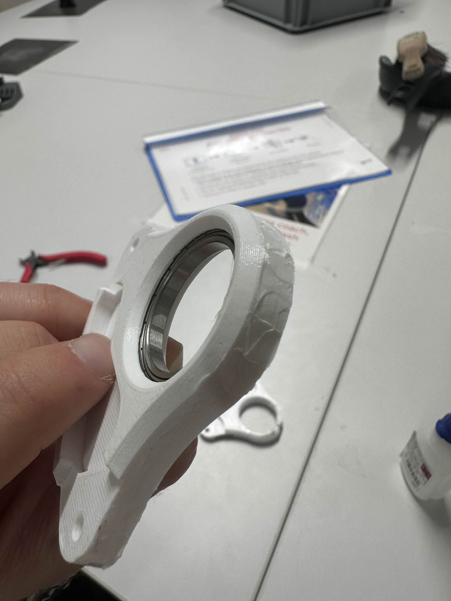

Week of 04.10.2025
==================

**Members present for 29.09.2025 work session** : *Johann, Loïc, Liam, Adam, Maxime, Anaïs, Luis, Louis*

**Members present for 04.10.2025 work session** : *Loïc, Liam, Adam, Maxime, Anaïs, Luis, Christy*

**Mechanical Side**

- **Johnan and Maxime**

  - seem to have figured out how to get rid of the "jeu" in the legs
  - started to create the dxf for the boxes (400*200*200 [mm])

- **Maxime**

  - assembled the leg and verified that the jeu actually improved a lot!
  - started printing all the other shoulders for the legs

   :width: 10px
   :align: center

  

- **Louis**

  - cut the plexiglass and is printing a new "back" for the robot

**Electronical Side**

- **Liam**

  - figured out the wiring between the rpi and the breakout board. The breakout board works fine

- **Anaïs**

  - made a connector (but flipped the colours oups) to test out the battery voltage. We need to change your math for the resistor bridge bc the components on the board are different than from the schematic.
  - validated her script to sense the voltage of the battery and it works quite well!

- **Christy**

  - made the voltage divider to sense the voltage on the motors.

**Software Side**

- **Luis**

  - is working on a calibration script for the legs
  -  is still working on the calibration script

- **Adam**

  - trying to figure out how ot get the GUI working through docker *(hard!)*
  - Got GUI to work
  - Managed to set up the ssh with the pi 

**Quality of Life**

- **Johnan**

  - Cut and built the boxes for 3D Parts and Electronics, need to be tested.

.. include:: _sidebar.rst
  
