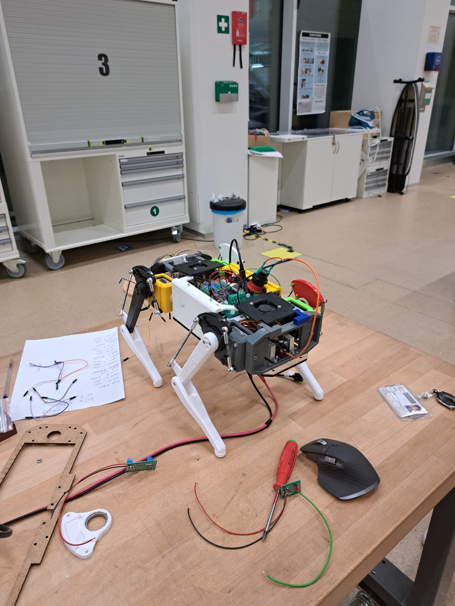

Week of 11.10.2025
==================

**Members present for 06.10.2025 work session** : *Johann, Loïc, Liam, Adam, Anaïs, Luis, Louis, Christy*

**Members present for 08.10.2025 impromptu work session** : *Loïc, Anaïs, Liam, Adam*

**Members present for 09.10.2025 impromptu work session** : *Johnan, Adam*

**Mechanical Side**

- **Johnan**

  - Mounted the reinforced legs

**Electronical Side**

- **Johnan**

  - Soldered the fans properly

- **Liam**

  -  Figured out serial communication (using USB not the level shifters)

- **Annaïs**

  - Printed hello world on the LCD

- **Christy**

  - Debugging the resistor bridge

**Software Side**

- **Adam**

  - Simulation works!
  - Able to control a servo motor using I2C and the pi. 
  - Tested out our second PWM board and it works fine
  - Problem with package compatibility

- **Luis and Loïc**

  - Managed to get the calibration script to work
  - Made the robot stand

|

.. include:: _sidebar.rst