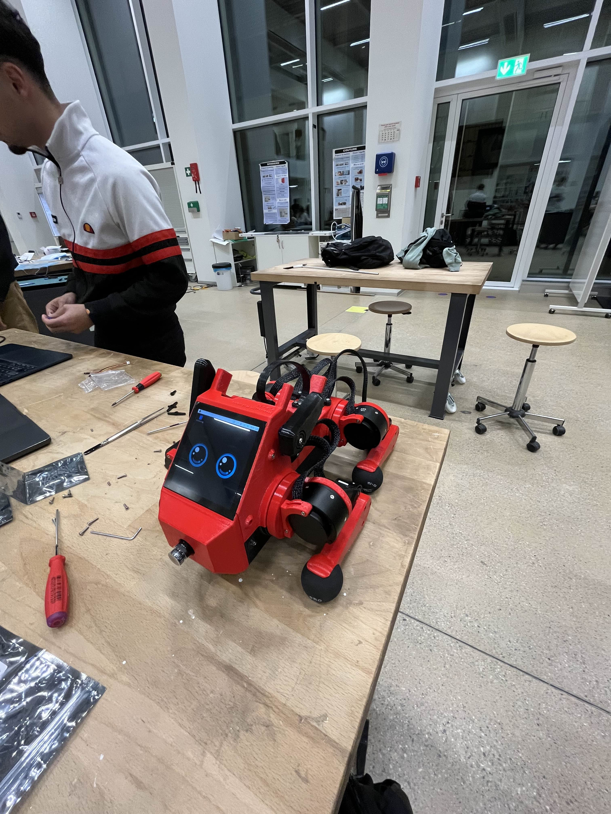

Week of 07.11.2025
==================

**Important events of the week** : DINGO kind of walked, Pupper walked!

**Mechanical Side**

- Pupper has been assembled
- Motor in DINGO has been replaced with the proper motor

**Electronical Side**

- Servos have been soldered for the Pupper ears

**Software Side**

- Successfully tested Pupper's code
- Liam and Adam started going through the Labs

DINGO first steps
-----------------

.. video:: ../assets/dingo_steps.mp4
  :align: center

|

Pupper Built
------------

|

Pupper first steps
------------------

.. video:: ../assets/pupper_steps.mp4
  :align: center

|

.. include:: _sidebar.rst