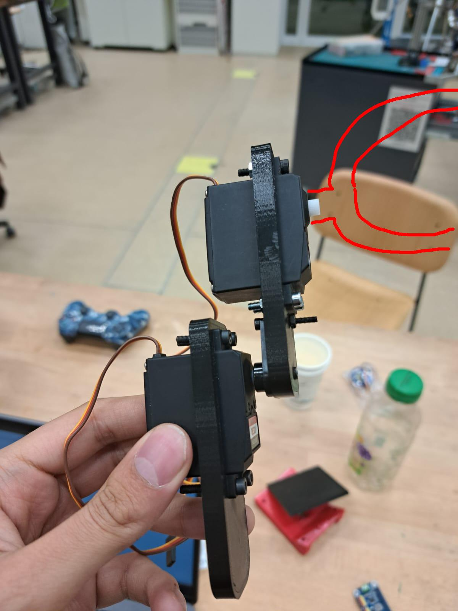

Week of 22.11.2025
==================

**Important events of the week** : Journée des Gymnasiens! Dingo walked a bit. We started to build an Arm + gripper for Pupper

**Mechanical Side**

- Dingo has been reinforced with zip ties and can walk (although not too well)!
- Johnan made  aplan on how to assemble the arm
- Anaïs started assembly
- Liam printin the gripper

**Software Side**

- Adam working on arm code + prepared ros information page
- Liam started training an RL policy on pupper

DINGO walking with zipties lol
------------------------------

.. video:: ../assets/dingo_walking.mp4
  :align: center

|

Started to build our arm
------------------------

